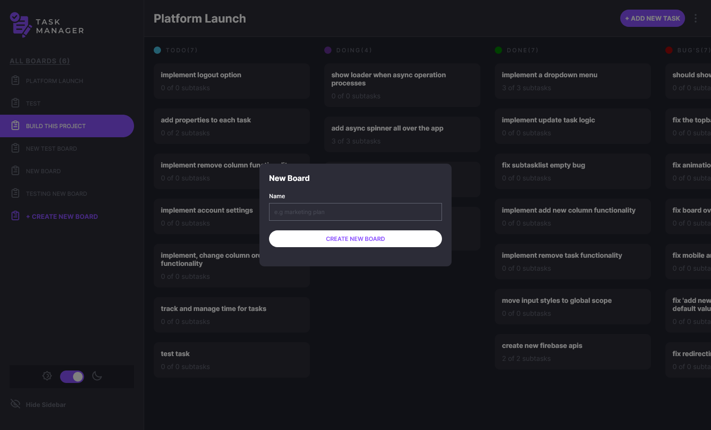
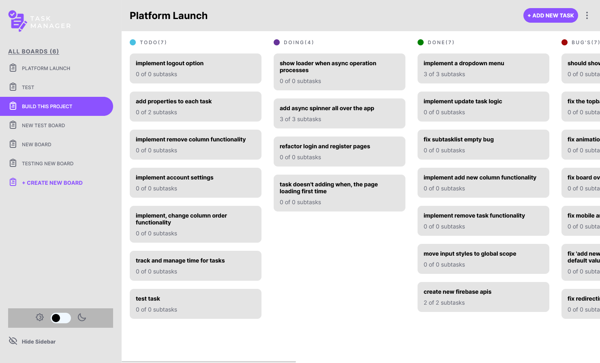
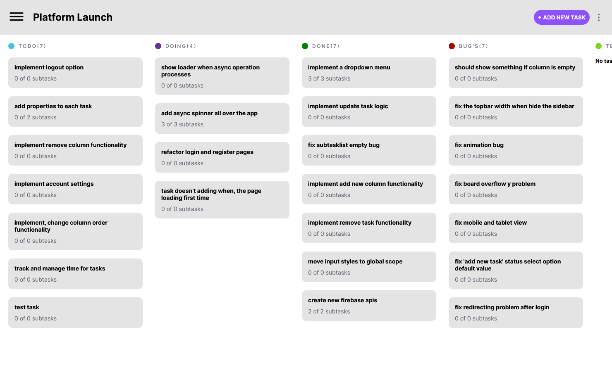
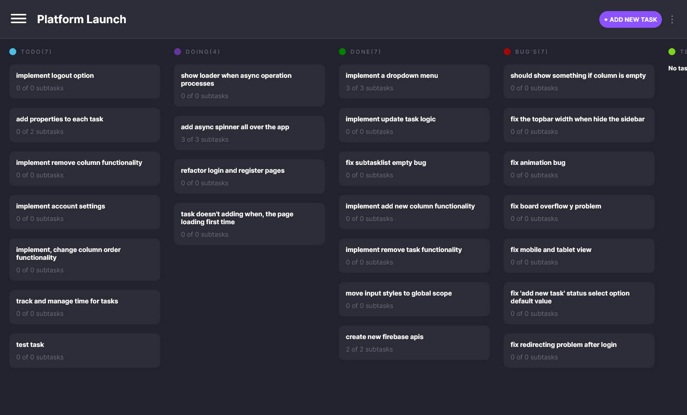
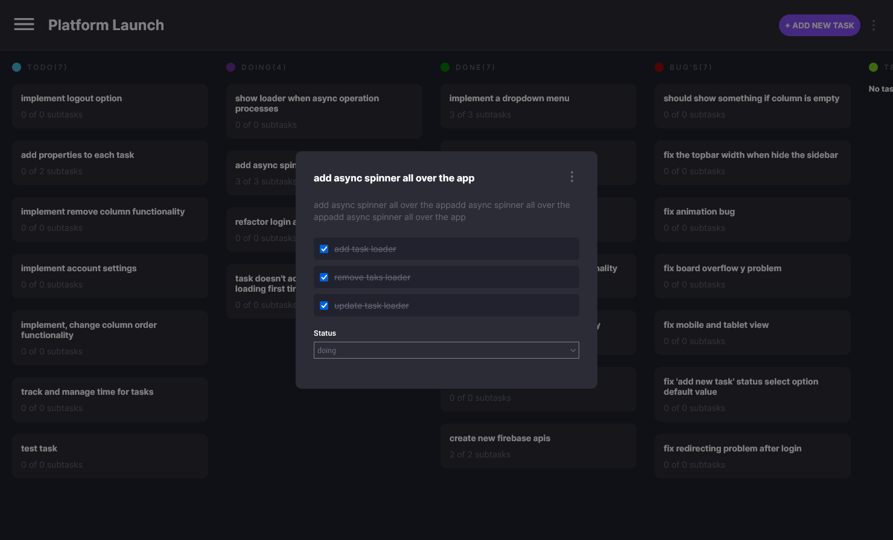
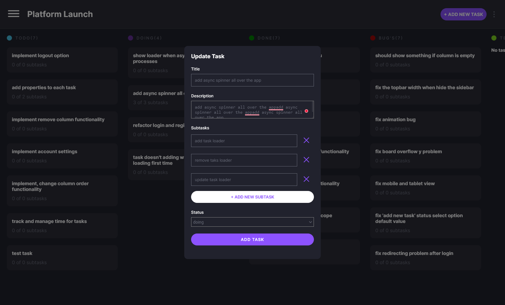

# TASK MANAGMENT APP INSPIRED FROM [FRONTENDMENTOR](https://www.frontendmentor.io/challenges/kanban-task-management-web-app-wgQLt-HlbB) CHALLENGES

## It is an application where we can create, delete and update the record of tasks in order to better manage the process while developing a project.

# TOOLS

- 
- 
- 
- 

## Screenshoots

